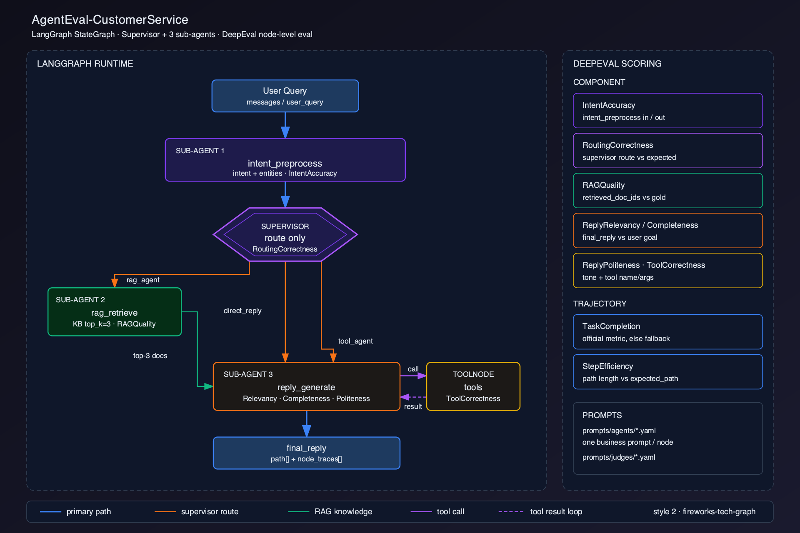

# AgentEval-CustomerService

基于 **LangGraph（StateGraph）+ DeepEval** 的智能客服 Agent **节点级评测** Demo。

目标不是再做一个能聊天的客服，而是把生产里真正要盯的东西跑通：

- 最终回复对了，**不代表**中间节点对了
- Supervisor 分错子 Agent，往往要到用户投诉才会被发现
- RAG 检索到噪声文档，生成节点会一本正经地胡编
- 所以：**每个关键节点单独 Trace，单独打分，并给出理由**

本仓库可以零模型直接跑（启发式 Agent + 确定性指标）。接上 OpenAI 或本地 Ollama 后，会走 DeepEval 官方推荐的 `CallbackHandler` + `GEval` / `TaskCompletionMetric`。

---

## 架构



整条 `path` + tools + reply → Trajectory：`TaskCompletion` + `StepEfficiency`。

预处理会扫描黄赌毒等关键词：命中则意图为 `policy_violation`，路由 `blocked`，立刻声明服务边界并结束，不进 Supervisor / RAG / 工具。词表在 `prompts/agents/intent_preprocess.yaml` 的 `policy.safety`。

职责边界规则在 `prompts/rules/duty_boundary.yaml`：天气、代写、理财、法律、医疗、竞品客服、越狱改身份等会标成 `out_of_scope`，回复必须**声明职责边界**，且不调用工具。黄赌毒仍走更严的安全拦截。

对应代码：


| 角色        | 节点                              | 文件                                      |
| --------- | ------------------------------- | --------------------------------------- |
| 子 Agent 1 | `intent_preprocess`             | `graph/nodes.py` + `graph/safety.py` + `graph/rules.py` |
| 主 Agent   | `supervisor`                    | `graph/nodes.py`                        |
| 子 Agent 2 | `rag_retrieve`                  | `graph/nodes.py` + `graph/retriever.py` |
| 子 Agent 3 | `reply_generate` + `tools`      | `graph/nodes.py` + `graph/tools.py`     |
| 组图        | `StateGraph`                    | `graph/graph.py`                        |
| 指标        | GEval / TaskCompletion / 回退     | `evaluator/metrics.py`                  |
| 跑评测       | Dataset → Trace → 打分 → Markdown | `evaluator/runner.py`                   |


---


## 评测设计（为什么这样拆）

DeepEval 官方把 Agent 评测分成两层，本 Demo 两层都做：


| 层级                  | 看什么             | 本仓库指标                                                                                                                       |
| ------------------- | --------------- | --------------------------------------------------------------------------------------------------------------------------- |
| **Component-level** | 单个节点的输入/输出      | `IntentAccuracy` `RoutingCorrectness` `RAGQuality` `ReplyRelevancy` `ReplyCompleteness` `ReplyPoliteness` `ToolCorrectness` |
| **Trajectory**      | 整条路径是否完成任务、是否绕路 | `TaskCompletion`（优先官方 `TaskCompletionMetric`）`StepEfficiency`                                                               |


节点级用 `GEval` 自定义标准（有裁判模型时）；工具用官方 `ToolCorrectnessMetric`（确定性，不依赖 LLM）。没有 API Key 时自动回退到带**中文理由**的确定性指标，保证 `python main.py` 总能出报告。

LangGraph 侧按官方推荐接入：

```python
from deepeval.integrations.langchain import CallbackHandler

graph.invoke(
    {...},
    config={"callbacks": [CallbackHandler(name="customer-service-graph")]},
)
```

有裁判模型时，还会用 `EvaluationDataset.evals_iterator(metrics=[TaskCompletionMetric()])` 对轨迹再跑一遍官方接口。

---


## 快速开始

```bash
cd AgentEval-CustomerService
python3 -m venv .venv
source .venv/bin/activate
pip install -r requirements.txt

python main.py                 # 跑全部用例，写出 Markdown 报告
python main.py --limit 3       # 先看 3 条
python main.py --query "帮我查一下订单 A20240901 发到哪了？"
python -m pytest evaluator/test_eval.py -q
```

默认 `AGENT_LLM=heuristic`、`JUDGE_LLM=auto`：没配 Key 就走启发式客服 + 确定性打分，适合把结构和报告先跑通。

报告位置：

- `results/latest.md` — 最近一次
- `results/report-<时间戳>.md` — 历史
- `results/example_report.md` — 仓库自带样例

---


## 接模型（可选）

复制环境变量：

```bash
cp .env.example .env
```


### OpenAI

```bash
export OPENAI_API_KEY=sk-...
export AGENT_LLM=openai          # 节点里的意图/路由/回复走 LLM
export JUDGE_LLM=openai          # DeepEval GEval / TaskCompletion 走 LLM-as-judge
export OPENAI_MODEL=gpt-4o-mini
```

兼容国内中转时设置 `OPENAI_BASE_URL`。

### Ollama（本地）

```bash
ollama pull qwen2.5:7b
export AGENT_LLM=ollama
export JUDGE_LLM=ollama
export OLLAMA_MODEL=qwen2.5:7b
export OLLAMA_BASE_URL=http://localhost:11434
```

`JUDGE_LLM=auto` 时：有 `OPENAI_API_KEY` 用 OpenAI，否则探测 Ollama，再否则确定性回退。

没有 `CONFIDENT_API_KEY` 时，`main.py` 会把 `CONFIDENT_TRACING_ENABLED=NO`，避免 DeepEval 反复打印 skip posting。若要把 Trace 传到 Confident AI，设置 Key 并把该变量设为 `YES`。

---


## 数据

`data/test_cases.json` 每条用例带节点级标注，这是「可评」的前提：

```json
{
  "id": "tc_order_status",
  "query": "帮我查一下订单 A20240901 发到哪了？",
  "expected_intent": "order_status",
  "expected_route": "tool_agent",
  "expected_path": ["intent_preprocess", "supervisor", "reply_generate", "tools", "reply_generate"],
  "expected_tools": ["lookup_order", "get_shipping_status"],
  "relevant_doc_ids": [],
  "expected_reply_points": ["已发货", "顺丰"],
  "task": "调用订单和物流工具，向用户同步真实履约状态。"
}
```

模拟知识库在 `data/knowledge_base.json`，模拟订单/库存/积分/质保在 `graph/tools.py`。可用订单号：`A20240901`（已发货）、`A20240888`（已签收、可退）、`A20240700`（超 7 天）、`A20241002`（待发货）。

回复子 Agent 现有 **7** 个 mock 工具：

- 原有：`lookup_order` `get_shipping_status` `calculate_refund` `create_ticket`
- 新增：`check_stock`（库存/仓位）、`lookup_member_points`（积分/等级）、`check_warranty`（是否在保）

---


## 如何二开

**改业务 / 评测提示词**

1. 业务：只改 `prompts/agents/<agent>.yaml`（每个 Agent 一份，互不影响）
2. 评测：只改 `prompts/judges/<Metric>.yaml`（每个指标一份 `criteria` + `evaluation_steps`）
3. 实验包：把覆盖文件放到 `prompts/packs/<name>/`，然后 `PROMPT_PACK=<name>`
4. 单 Agent 评测：`python main.py --agent supervisor`（整图仍跑，报告只留该节点指标）

```bash
python main.py --list-prompts
python main.py --agent intent_preprocess
python -m prompts
```

**加一种意图 / 改路由**

1. `graph/state.py` 的 `VALID_INTENTS`、`INTENT_TO_ROUTE`
2. `graph/nodes.py` 的 `INTENT_KEYWORDS`（启发式）；LLM 模式改 `prompts/agents/supervisor.yaml` 与 `intent_preprocess.yaml`
3. 在 `data/test_cases.json` 加带标注的用例

**给回复 Agent 加工具**

1. 在 `graph/tools.py` 用 `@tool` 写函数，加入 `CUSTOMER_TOOLS`
2. 启发式规划在 `graph/nodes.py` 的 `_plan_heuristic_tools`
3. 测试用例写上 `expected_tools`

**加一个要打分的节点**

1. 节点函数里用 `_trace(...)` 把 input/output 写进 `state["node_traces"]`
2. 在 `prompts/judges/` 加一份指标 YAML，再在 `evaluator/metrics.py` 接线
3. 在 `evaluator/runner.py` 的 `evaluate_graph_result` 里调用，报告会自动出现新列

**只评某一个节点**

`python main.py --agent rag_retrieve`。也可以直接看报告里的「节点级 Component Scores」。不要把「最终回复还行」当成系统健康。

---


## 项目结构

```text
AgentEval-CustomerService/
├── README.md
├── requirements.txt
├── main.py                      # 可直接运行
├── prompts/
│   ├── agents/                  # 每个 Agent 一份业务 prompt
│   ├── judges/                  # 每个指标一份 judge prompt
│   ├── rules/                   # 职责边界等规则
│   └── loader.py
├── graph/
│   ├── state.py                 # AgentState + 路由表
│   ├── nodes.py                 # 四个关键节点 + ToolNode 包装
│   ├── safety.py                # 预处理黄赌毒关键词过滤
│   ├── rules.py                 # 职责边界识别与声明
│   ├── graph.py                 # StateGraph + DeepEval CallbackHandler
│   ├── tools.py                 # 回复子 Agent 的工具
│   ├── retriever.py             # 模拟知识库检索
│   └── llm.py                   # heuristic / OpenAI / Ollama
├── evaluator/
│   ├── metrics.py               # GEval 自定义指标 + 回退
│   ├── test_eval.py             # pytest
│   ├── runner.py
│   ├── reporter.py
│   └── judge.py
├── data/
│   ├── knowledge_base.json
│   └── test_cases.json
└── results/
```

---


## 设计取舍

- **Supervisor 禁止写最终回复**，避免「主 Agent 自己把活干了、路由指标永远 1 分」。
- **回复节点绑定真实工具**（`ToolNode`），而不是在 prompt 里假装调用，这样 `ToolCorrectness` 才有意义。
- **启发式模式不是生产实现**，是为了让克隆仓库的人不用申请 Key 也能看懂 Trace 和报告；换 `AGENT_LLM=openai|ollama` 即变成真 LLM 节点。
- 裁判模型和业务模型拆开（`JUDGE_LLM` vs `AGENT_LLM`），评测用更强的模型、业务可用更便宜的模型。

